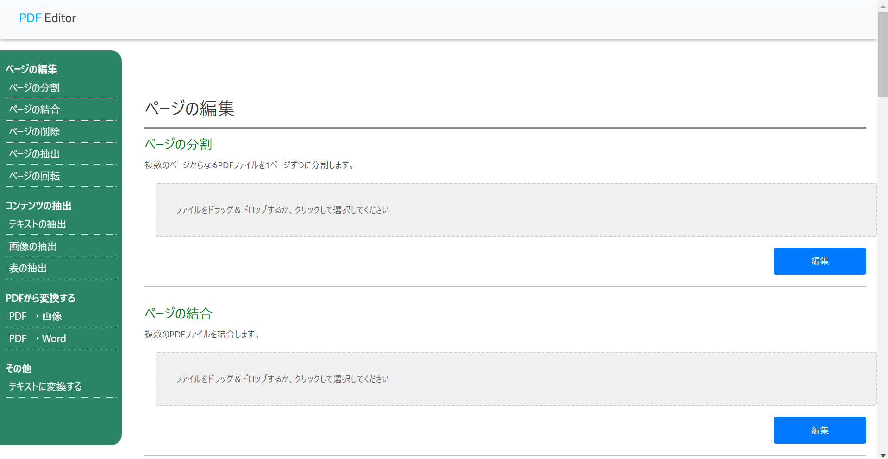

# PDF-Editor


[](https://nodejs.org/)
[](https://python.org/)
[](https://nextjs.org/)
[](https://flask.palletsprojects.com/)

## 概要

このプロジェクトは、PDF ファイルの分割、結合、コンテンツ抽出、および他形式への変換を提供する Web アプリです。

## デモ

[https://pdf-editor-red-seven.vercel.app/](https://pdf-editor-red-seven.vercel.app/)



## ローカル環境での実行方法(開発環境用)

1. リポジトリをクローンします:
   ```bash
   git clone https://github.com/yonep3904/pdf-editor
   cd ./pdf-editor
   ```
1. `/frontend`に移動しアプリケーションを起動します:
   ```bash
   cd ./frontend
   npm run dev
   ```

### API サーバーをローカル環境で実行する場合

1. `/backend`に移動し必要な依存関係をインストールします:
   ```bash
   cd ./backend
   pip install -r requirements.txt
   ```
1. `/backend/app.py`を実行して API サーバーを起動します:
   ```bash
   python app.py
   ```
1. `/frontend/next.config.mjs`内の`API_BASE_URL`をローカルホスト`http://localhost:5000`に変更します:
   ```JavaScript
   const nextConfig = {
     env: {
       API_BASE_URL: "http://localhost:5000", // 変更
     },
   };
   ```
1. `/frontend`に移動しアプリケーションを起動します。

## 機能一覧

- PDF の分割と結合
- PDF ページの抽出と削除・回転
- ページ内容(テキスト/画像/表データ)の抽出
- PDF から他形式(画像, Word)への変換
- ドキュメントファイル等(.pdf, .pptx, .xlsx, .docx, .csv, .json, .xml, .html)からテキストデータ(.md)への変換

## 貢献方法

バグ報告や機能提案は [Issues](https://github.com/yonep3904/pdf-editor/issues) からお願いします。

### コントリビューション手順

1. リポジトリをフォークします。
1. 新しいブランチを作成します:

   ```bash
   git checkout -b feature/新機能名
   ```

1. 変更をコミットしてプッシュします:
   ```bash
   git commit -m "Add 新機能"
   git push origin feature/新機能名
   ```
1. プルリクエストを送信します

## ライセンス

このプロジェクトは [MIT ライセンス](LICENSE) の下で公開されています。
